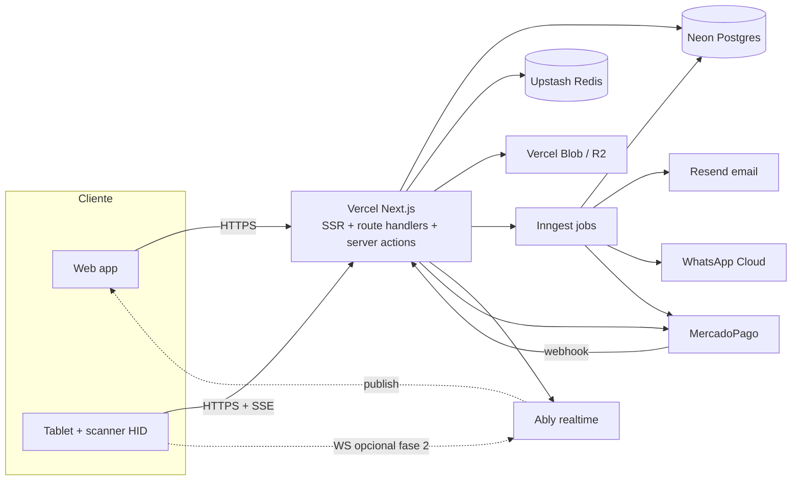

# 01 — Arquitectura general

## Plataforma: Vercel-native, single Next.js app

BZAPP es **una sola aplicación Next.js 15** desplegada en Vercel. No hay backend separado: la API vive como **route handlers** y **server actions** dentro de la misma app. Los jobs en background corren en **Inngest**, el realtime en **Ably**, la DB en **Neon**, la cache y rate-limiting en **Upstash Redis**.

Esta consolidación reduce drásticamente la infra a operar sin sacrificar capacidades. El multi-tenancy, RBAC y modelo de datos siguen siendo los mismos (ver [02](02-multi-tenant.md) y [03](03-data-model.md)).

## Objetivos no funcionales

| Atributo | Objetivo |
| --- | --- |
| Latencia `/access/check` | < 250 ms p95 dentro de región (Vercel gru1 + Neon sa-east-1) |
| Latencia general API | < 400 ms p95 |
| Disponibilidad | 99.9 % mensual |
| Throughput por organización | 100 escaneos/min sostenidos (Vercel function concurrency) |
| RPO / RTO | 15 min / 1 h (Neon point-in-time restore) |
| Cold start tolerable | < 800 ms p95 (Node runtime, Vercel Fluid Compute) |

## Diagrama de alto nivel



## Stack

### Frontend + Backend unificado (`apps/web` o root)

- **Next.js 15** (App Router, React Server Components, route handlers, server actions).
- **TypeScript** estricto.
- **Tailwind CSS** + **shadcn/ui**. Tokens propios para branding por tenant.
- **TanStack Query** en client components (mutations, optimistic UI).
- **Zustand** para estado UI complejo (cockpit).
- **next-intl** para i18n (ES-AR default, EN segundo).
- **Auth propia** con JWT + refresh tokens en cookies httpOnly. Sesiones server-side validadas con Upstash. No usamos NextAuth porque el modelo multi-tenant (un user → varias orgs, switch contextual) lo hace incómodo; el código auth vive en `lib/auth/`.
- **Prisma** como ORM con `@prisma/adapter-neon` (driver serverless de Neon) para latencia baja.

### Jobs en background — Inngest

Inngest reemplaza al worker BullMQ. Cada función Inngest se define en código y se sirve desde `/api/inngest`. Vercel y Inngest se hablan por HTTP, sin procesos persistentes.

Casos de uso:
- Procesar webhooks de MercadoPago (idempotente, con reintentos)
- Generación de invoice PDF
- Envío de email y WhatsApp
- OCR de patentes (llamada al ALPR provider)
- Export de reportes
- Dunning de suscripciones (cron + step.sleep)
- Retención y archivado de access_events
- Disparo de webhooks salientes a clientes

```ts
// lib/inngest/functions/process-mp-webhook.ts
export const processMpWebhook = inngest.createFunction(
  { id: 'process-mp-webhook', concurrency: { key: 'event.data.preapprovalId', limit: 1 } },
  { event: 'mp/webhook.received' },
  async ({ event, step }) => {
    const sub = await step.run('load-subscription', () => ...);
    await step.run('apply-transition', () => ...);
    await step.run('emit-invoice', () => ...);
  },
);
```

### Realtime — SSE primero, Ably en fase 2

**Server-Sent Events** sobre Next.js route handler con runtime Node. Suficiente para feed unidireccional (accesos, alertas, KPIs). Pub/sub vía **Postgres LISTEN/NOTIFY** o **Upstash Redis pub/sub**.

```ts
// app/api/v1/access/feed/route.ts
export const runtime = 'nodejs';
export const dynamic = 'force-dynamic';

export async function GET(req: Request) {
  const ctx = await requireTenant(req);
  const stream = new ReadableStream({
    async start(controller) {
      const sub = await redis.subscribe(`org:${ctx.organizationId}:access`, (msg) => {
        controller.enqueue(`event: access.event.created\ndata: ${msg}\n\n`);
      });
      // heartbeat + cleanup en abort
    },
  });
  return new Response(stream, { headers: { 'content-type': 'text/event-stream' } });
}
```

**Ably** se agrega en fase 2 para canales bidireccionales (comandos remotos a garita, presencia de guardias en línea).

### Datos

- **Neon Postgres** (serverless, branching por PR). Plan inicial Launch (USD 19/mes), región `aws-sa-east-1`.
- **Upstash Redis** (HTTP, global edge). Plan free → Pay-as-you-go.
- **Vercel Blob** o **Cloudflare R2** para uploads (fotos visitantes, evidencias, exports). Elegir según costo de egress esperado: R2 es más barato a escala.

### Email y mensajería

- **Resend** para email transaccional (verificación, magic links, invoices, dunning).
- **WhatsApp Cloud API** (Meta) para notificaciones a residentes y QRs de visita.

### Auth

- JWT propio firmado con secret rotable (`JOSE` library). Access token 15 min en cookie httpOnly secure.
- Refresh token 30 días, rotativo, hash en Postgres con device fingerprint.
- MFA TOTP opcional, obligatorio para super admin.
- Magic links para invitaciones (token firmado, single-use).

### Pagos — MercadoPago

Sin cambios respecto al diseño original. Detalle en [05 — Billing](05-billing.md). Cambia solo el ejecutor: ahora los webhooks los procesa Inngest, no un worker BullMQ.

### Observabilidad

- **Vercel Observability** + **Vercel Speed Insights** + **Vercel Web Analytics**.
- **Sentry** para errores client + server.
- **Axiom** o **Logtail** para logs estructurados (Vercel log drain).
- **Inngest dashboard** para inspección de jobs (reintentos, fails, replay).

## Monorepo (opcional, recomendable)

Aún con todo consolidado, conviene un monorepo mínimo para extraer paquetes reutilizables (parser DNI, design tokens, types). Gestionado con **pnpm workspaces** + **Turborepo**:

```
apps/
  web/                # única app Next.js (web + API + onboarding + admin)
packages/
  db/                 # Prisma schema, client, migrations, RLS
  ui/                 # componentes shadcn-derived, tokens
  scanner/            # parser PDF417 + utilidades HID
  types/              # enums y DTOs compartidos (consumidos por web)
  config/             # eslint, tsconfig, tailwind base
```

Si preferís simplificar al máximo, todo puede vivir como **una sola app Next.js sin monorepo** — los packages se vuelven carpetas en `lib/`. Es trivial migrar después.

Detalle completo en [10 — Folder structure](10-folder-structure.md).

## Capas dentro de Next.js

Aunque sea una sola app, mantener separación de capas:

1. **Route handlers** (`app/api/v1/.../route.ts`) y **server actions** — entrypoints HTTP. Sin lógica. Validan input con Zod, llaman al service.
2. **Services** (`lib/server/services/...`) — lógica de dominio, transacciones, llamadas a otros services.
3. **Repositories** (`lib/server/repos/...`) — único lugar que toca `prisma.*`.
4. **Domain** (`lib/server/domain/...`) — entidades, value objects, eventos.
5. **Infra** (`lib/server/infra/...`) — adaptadores: MercadoPago, WhatsApp, Resend, Blob, Ably, Inngest.

Reglas:
- Server-only code en `lib/server/**` con `import 'server-only'` arriba para evitar fugas al bundle cliente.
- Route handlers nunca importan Prisma directamente — siempre vía service.
- Server actions usan los mismos services que las route handlers.

## Decisiones clave

- **RSC por defecto.** `"use client"` solo donde hay interactividad real. El cockpit del guardia es client-heavy; el resto es mayormente server-rendered.
- **Region única al inicio:** Vercel `gru1` (São Paulo) + Neon `aws-sa-east-1`. Mantiene Next.js Function y DB en la misma región y minimiza RTT.
- **Sin Edge runtime** para route handlers que tocan Prisma — Neon driver es serverless pero Prisma engine quiere Node runtime. Edge se usa solo en middleware (auth gate barato) y en assets.
- **Sin GraphQL.** REST + tipos compartidos vía `packages/types` o `lib/types`.
- **Tenancy igual que en el diseño original**: tabla compartida + `organization_id` + Prisma middleware + RLS. Ver [02](02-multi-tenant.md).
- **Idempotencia explícita** en todo endpoint que crea cobros o dispara acciones externas (header `Idempotency-Key` persistido en `WebhookEvent` o tabla análoga).
