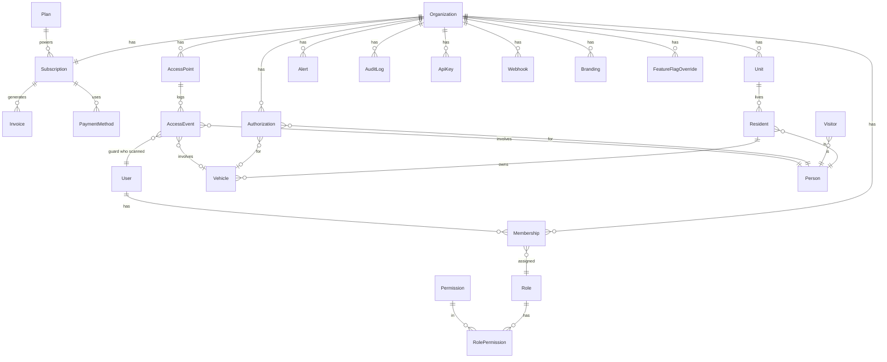

# 03 — Modelo de datos

Este documento describe las entidades del dominio. El schema ejecutable vive en [prisma/schema.prisma](../prisma/schema.prisma).

## Convenciones

- IDs: `uuid` v7 (ordenable temporalmente) para todas las tablas.
- Timestamps: `created_at`, `updated_at` en todas. `deleted_at` (soft delete) donde aplica.
- `organization_id` en toda tabla tenant-scoped.
- Enums en mayúsculas (`ACTIVE`, `SUSPENDED`).
- Auditoría: cambios sensibles emiten `AuditLog`.

## Diagrama ER (alto nivel)

## Catálogo de entidades

### Plataforma (sin `organization_id`)

#### `Plan`
Planes comerciales definidos por super admin.
- `code` (Starter, Growth, Pro, Enterprise)
- `name`, `description`
- `price_monthly_cents`, `price_yearly_cents`, `currency`
- `limits` (JSONB): `max_users`, `max_residents`, `max_accesses_month`, `max_storage_mb`, `max_access_points`
- `features` (JSONB): `whatsapp`, `email`, `ocr_plates`, `api_access`, `sso`, `audit_export`, `custom_branding`
- `mp_plan_id` (preapproval_plan_id en MercadoPago)
- `is_public` (visible en pricing page)

#### `FeatureFlag`
Flags globales con default. Pueden override por organización vía `FeatureFlagOverride`.

#### `PlatformAuditLog`
Auditoría de acciones de super admin. Inmutable (append-only).

#### `WebhookEvent` (raw inbox)
Eventos crudos de MercadoPago u otros. Procesados con idempotencia.

### Tenant (con `organization_id`)

#### `Organization`
- `slug` (único, para subdomain)
- `name`, `legal_name`, `tax_id`
- `type` (`COUNTRY`, `BUILDING`, `INDUSTRIAL_PARK`, `OFFICE`, `CLUB`, `OTHER`)
- `country`, `timezone`, `locale`
- `status` (`TRIALING`, `ACTIVE`, `PAST_DUE`, `SUSPENDED`, `CANCELED`)
- `onboarding_completed_at`
- `metadata` (JSONB)

#### `Branding` (1:1 con Organization)
- `logo_url`, `favicon_url`
- `primary_color`, `accent_color`, `background_mode` (`LIGHT`, `DARK`, `AUTO`)
- `font_family` (opcional)
- `email_from_name`, `email_signature_html`

#### `User`
Cuenta global. Una `User` puede pertenecer a múltiples organizaciones vía `Membership`.
- `email` (único global)
- `password_hash` (argon2id) — nullable para SSO
- `name`, `phone`
- `email_verified_at`, `phone_verified_at`
- `mfa_secret`, `mfa_enabled_at`
- `last_login_at`
- `is_platform_admin` (super admin de plataforma)

#### `Membership` (User ↔ Organization)
- `user_id`, `organization_id`
- `status` (`INVITED`, `ACTIVE`, `SUSPENDED`)
- `invited_by_user_id`, `joined_at`
- Tiene N `Role`s asignados.

#### `Role` y `Permission`
Detalle en [04 — RBAC](04-rbac-permissions.md).

#### `Subscription`
- `organization_id` (1:1)
- `plan_id`, `status`, `interval` (`MONTHLY`, `YEARLY`)
- `mp_preapproval_id`
- `current_period_start`, `current_period_end`
- `trial_ends_at`
- `canceled_at`, `cancellation_reason`
- `seats_used`, `accesses_this_period`

#### `Invoice`
- `organization_id`, `subscription_id`
- `number` (correlativo por organización)
- `amount_cents`, `currency`, `status` (`OPEN`, `PAID`, `VOID`, `UNCOLLECTIBLE`)
- `issued_at`, `due_at`, `paid_at`
- `mp_payment_id`
- `pdf_url`

#### `PaymentMethod`
- `mp_card_id` o token, `last4`, `brand`, `holder`
- `is_default`

#### `Person`
Identidad reutilizable dentro de una organización. Tanto residentes como visitantes son `Person`.
- `document_type` (`DNI`, `CUIT`, `PASSPORT`, `OTHER`)
- `document_number`
- `first_name`, `last_name`, `birth_date`, `gender`
- `photo_url`, `phone`, `email`
- `notes`

Índice único `(organization_id, document_type, document_number)`.

#### `Unit`
Lote, departamento, oficina, espacio asignable.
- `code` (ej. "A-32", "Torre 1 - 4°B")
- `kind` (`LOT`, `APARTMENT`, `OFFICE`, `WAREHOUSE`)
- `address_line` opcional
- `metadata` (JSONB)

#### `Resident`
Vincula `Person` a `Unit` con rol en la unidad.
- `person_id`, `unit_id`
- `relation` (`OWNER`, `TENANT`, `FAMILY`, `STAFF`, `GUEST_PERMANENT`)
- `status` (`ACTIVE`, `INACTIVE`)
- `move_in_at`, `move_out_at`

#### `Visitor` (vista lógica)
No es tabla separada — un `Person` que aparece en `AccessEvent` o `Authorization` sin `Resident` activo. Materializado vía vista en SQL para reportes.

#### `Vehicle`
- `plate` (normalizada upper, sin espacios)
- `kind` (`CAR`, `MOTORCYCLE`, `TRUCK`, `BICYCLE`)
- `make`, `model`, `color`
- `owner_person_id` (nullable — auto, prestado, ride)
- `is_authorized_permanent`

Índice único `(organization_id, plate)`.

#### `AccessPoint`
- `name` ("Garita principal", "Servicio")
- `kind` (`PEDESTRIAN`, `VEHICULAR`, `MIXED`)
- `direction` (`IN`, `OUT`, `BOTH`)
- `device_config` (JSONB: cámara, barrera, ALPR endpoint)
- `is_active`

#### `Authorization`
Pre-autorización emitida por un residente o admin.
- `created_by_user_id`, `for_person_id` (nullable si solo se autoriza patente)
- `for_vehicle_id` (nullable)
- `for_unit_id` (a qué unidad ingresa)
- `valid_from`, `valid_to`
- `recurrence` (JSONB: días, horarios)
- `kind` (`SINGLE_USE`, `MULTIPLE`, `RECURRING`, `OPEN`)
- `qr_code`, `qr_expires_at`
- `notes`, `status` (`ACTIVE`, `USED`, `EXPIRED`, `REVOKED`)

#### `AccessEvent`
El log central. Append-only.
- `access_point_id`, `direction`
- `person_id` (nullable si solo patente)
- `vehicle_id` (nullable)
- `authorization_id` (nullable)
- `guard_user_id` (quién escaneó)
- `scan_method` (`DNI_PDF417`, `QR`, `MANUAL`, `OCR_PLATE`, `FACE`, `RFID`)
- `outcome` (`GRANTED`, `DENIED`, `REVIEW`)
- `denial_reason` (enum)
- `raw_payload` (JSONB: el barcode crudo, response del ALPR, etc.)
- `photo_url`
- `occurred_at` (server time)
- `client_ts` (timestamp del dispositivo, opcional)

Particionada por `occurred_at` (mes) para performance — ver [09 — Infra](09-infrastructure.md).

#### `GuardShift`
- `guard_user_id`, `access_point_id`
- `started_at`, `ended_at`
- `handover_notes`

#### `Alert`
- `kind` (`PANIC`, `INTRUSION`, `BLACKLIST_MATCH`, `OVERSTAY`, `SYSTEM`)
- `severity` (`LOW`, `MEDIUM`, `HIGH`, `CRITICAL`)
- `title`, `description`
- `triggered_by` (event_id, user_id, system)
- `acknowledged_by_user_id`, `acknowledged_at`
- `resolved_at`

#### `Notification`
Outbox de mensajes salientes (email, WhatsApp, push). Manejada por worker.
- `channel`, `to`, `template`, `payload` (JSONB)
- `status` (`PENDING`, `SENT`, `FAILED`, `BOUNCED`)
- `attempts`, `last_error`

#### `AuditLog`
- `actor_user_id`, `action`, `resource_type`, `resource_id`
- `before` / `after` (JSONB)
- `ip`, `user_agent`
- `occurred_at`

#### `ApiKey`
- `name`, `prefix`, `hash` (sha256), `last_used_at`
- `scopes` (array)
- `expires_at`, `revoked_at`

#### `WebhookEndpoint`
- `url`, `secret`, `events` (array), `is_active`
- `last_delivery_at`, `failure_count`

#### `Integration`
- `kind` (`WHATSAPP`, `EMAIL_SMTP`, `CAMERA_HIKVISION`, `BARRIER_NICE`, `ALPR`)
- `config` (JSONB cifrado con KMS por entry sensible)
- `status`, `last_check_at`

#### `Blocklist`
Personas o patentes prohibidas.
- `kind` (`PERSON`, `VEHICLE`)
- `reference_id` (person_id o vehicle_id) o `document_number` / `plate` libre
- `reason`, `added_by_user_id`, `expires_at`

#### `Document` / `Attachment`
Archivos genéricos asociados a entidades (foto carnet, contrato, etc.).
- `entity_type`, `entity_id`
- `s3_key`, `mime`, `size`, `uploaded_by_user_id`

## Decisiones de diseño

- **`AccessEvent` es la entidad caliente.** Se diseña para inserción rápida y queries por rango temporal + access_point. Particionada mensualmente. Índices clave: `(organization_id, occurred_at DESC)`, `(organization_id, person_id, occurred_at DESC)`.
- **`Person` separado de `Resident` y `Visitor`.** Una persona puede pasar de visitante a residente sin perder historial. El mismo DNI no se duplica.
- **Soft delete con `deleted_at`** en entidades de catálogo (Resident, Vehicle, Authorization, Unit). En `AccessEvent` y `AuditLog` no se borra nunca — inmutables.
- **Encriptación a nivel campo** para `document_number`, `phone`, `email` de visitantes. Búsqueda por hash determinístico (`document_number_hash`).
- **JSONB para extensiones por tenant** (`metadata`) pero solo para datos no críticos. Lo importante va en columnas tipadas.
- **Numeración de facturas por organización**, no global. Secuencia per-org.
