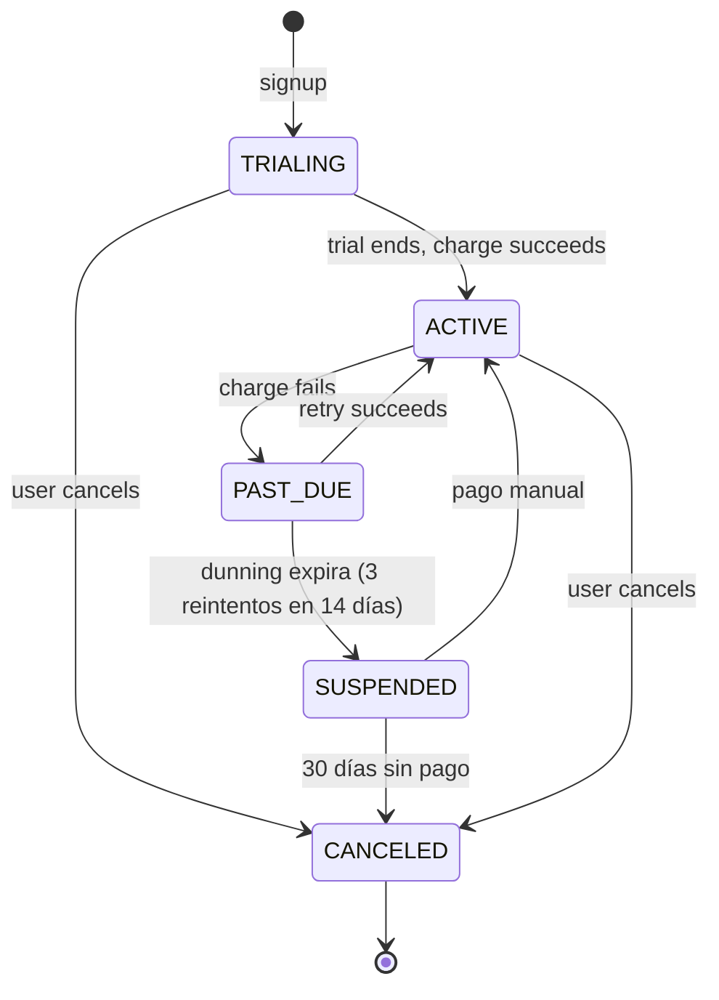

# 05 — Billing y suscripciones (MercadoPago)

## Por qué MercadoPago

Mercado de origen LATAM (Argentina principalmente). Cobertura tarjetas + efectivo + Pago Mil + débito. Costos competitivos, soporta suscripciones recurrentes vía Preapproval API.

## Productos MP usados

| Producto | Uso |
| --- | --- |
| **Preapproval (Suscripciones)** | Suscripción mensual / anual del plan |
| **Checkout Pro** | Pagos one-off (recarga de créditos, sobreuso, módulos add-on) |
| **Webhooks (Notifications v2)** | Eventos de pago, cambio de estado de preapproval |

## Ciclo de vida de una suscripción



| Estado | Acceso a la app |
| --- | --- |
| `TRIALING` | Completo, banner "Quedan N días" |
| `ACTIVE` | Completo |
| `PAST_DUE` | Completo + banner rojo "Actualizá tu medio de pago" |
| `SUSPENDED` | Solo billing y export. El resto en read-only con CTA de pago |
| `CANCELED` | Solo export por 30 días, luego solo billing |

## Flujo de alta de plan

### 1. Selección de plan en signup
- Si el plan tiene trial > 0, no se cobra al inicio. Se crea la `Subscription` en `TRIALING` sin tocar MP todavía. El usuario carga método de pago cuando quiera (forzado al final del trial).
- Si el plan no tiene trial o el usuario eligió pagar ya, se redirige a la URL de Preapproval de MP.

### 2. Creación del Preapproval

```ts
const preapproval = await mp.preapproval.create({
  reason: `BZAPP — ${organization.name} — Plan ${plan.code}`,
  external_reference: subscription.id,
  back_url: `${appUrl}/billing/return`,
  payer_email: user.email,
  auto_recurring: {
    frequency: 1,
    frequency_type: plan.interval === 'YEARLY' ? 'years' : 'months',
    transaction_amount: plan.priceFor(interval) / 100,
    currency_id: 'ARS',
    start_date: subscription.trial_ends_at ?? now,
  },
  status: 'pending',
});

subscription.mpPreapprovalId = preapproval.id;
await subscription.save();
return preapproval.init_point; // URL para redirect
```

### 3. Vuelta del usuario
MP redirige a `back_url`. El front consulta `/billing/subscription` que devuelve el estado (puede haber lag con el webhook).

### 4. Webhook autoriza
MP envía notificación cuando el preapproval pasa a `authorized`. El handler:

1. Recibe POST en `/webhooks/mercadopago`.
2. Verifica firma (header `x-signature` + `x-request-id` + secret).
3. Inserta el payload en `WebhookEvent` con su `mp_event_id` (UNIQUE) — si ya existía, devuelve 200 (idempotencia).
4. Emite evento Inngest `mp/webhook.received` con el payload.

La función Inngest `process-mp-webhook` (configurada con `concurrency.key = event.data.preapprovalId, limit: 1`):

1. Resuelve el `Subscription` por `external_reference` o `mp_preapproval_id` (`step.run`).
2. Aplica la transición según el `type` y `action` del evento (`step.run`).
3. Si fue `payment.created` con `status = approved` y el payment está vinculado al preapproval: crea `Invoice` marcada `PAID`, emite evento `invoice/created` que dispara generación de PDF + email.
4. Si fue `payment.created` con `status = rejected`: marca subscription `PAST_DUE`, emite evento `billing/dunning.start`.
5. Marca el `WebhookEvent` como procesado.

Inngest provee dedupe y reintentos automáticos por step, así que no hace falta lógica custom.

## Eventos relevantes

| `type` | `action` | Significado |
| --- | --- | --- |
| `subscription_preapproval` | `created` | Suscripción creada (aún `pending`) |
| `subscription_preapproval` | `updated` | Cambio de estado (`authorized`, `paused`, `cancelled`) |
| `subscription_authorized_payment` | `created` | Se autorizó un cobro recurrente — usar para emitir Invoice |
| `payment` | `created` / `updated` | Estado del cobro individual |

## Dunning (reintentos)

Si una factura falla:

| Día | Acción |
| --- | --- |
| 0 | Falla. `PAST_DUE`. Email al owner. |
| 3 | Reintento automático (MP lo hace). Email recordatorio. |
| 7 | Reintento. Notificación in-app + email. |
| 14 | Suspensión. Banner full-screen al login. WhatsApp si está integrado. |
| 30 | Cancelación. |

El reintento real lo orquesta MP. Nosotros respondemos a los webhooks y movemos el estado.

## Cambios de plan

### Upgrade (precio mayor)
- Se calcula `proration` (días restantes del período × diferencia diaria).
- Se cobra el diferencial inmediatamente vía `Checkout Pro` (one-off) o como ajuste en la próxima factura, según el plan permita.
- Se actualiza el `Preapproval` con el nuevo `transaction_amount` para el siguiente período.

### Downgrade
- Se aplica al final del período actual. El usuario sigue con su plan hasta entonces.
- Si el plan nuevo tiene límites más bajos y los está excediendo, banner advirtiendo. No se borran datos automáticamente.

### Cambio de frecuencia (mensual ↔ anual)
- MP no permite cambiar `frequency_type` en un preapproval existente. Se cancela el actual y se crea uno nuevo. Tx atómica en nuestro lado.

## Cancelación

- Botón en `/settings/billing/cancel`. Requiere re-autenticación.
- Llamada a MP `PUT /preapproval/:id` con `status: 'cancelled'`.
- Subscription pasa a `CANCELED` pero sigue `ACTIVE` hasta `current_period_end` (no reembolso).
- Email de despedida + survey opcional.

## Sobreuso y módulos add-on

Para planes con límite blando (`max_accesses_month` soft):

1. Una función Inngest cron (`billing/calculate-overage`) calcula el sobreuso al cierre del período.
2. Si la organización tiene `billing.allow_overage = true`, se crea una `Invoice` extra con line items.
3. Se cobra vía Checkout Pro one-off con `external_reference` apuntando a la invoice.

## Facturas

- Numeración por organización: prefijo + correlativo (ej. `BZ-AR-000123`).
- PDF generado por función Inngest (`generate-invoice-pdf`) con plantilla HTML + Puppeteer (Browserless o `@sparticuz/chromium` en Vercel). Subido a Blob/R2.
- Para Argentina: si el plan lo habilita, integrar **AFIP facturación electrónica** (fase 3, ver roadmap).

## Panel de billing (UI)

`/settings/billing`:

- Plan actual (con CTA de upgrade)
- Próximo cobro (monto + fecha)
- Método de pago (last4)
- Lista de facturas con descarga PDF
- Consumo actual vs límites (barras de progreso)
- Historial de cambios de plan

`/admin/organizations/:id/billing` (super admin):

- Todo lo anterior +
- Forzar cambio de plan
- Aplicar crédito / nota de crédito
- Marcar invoice como pagada manualmente
- Suspender / reactivar org

## Idempotencia y race conditions

- Todo POST que crea cobros usa `Idempotency-Key` header propagado a MP.
- Los webhooks se procesan single-flight por `mp_preapproval_id`: lock advisory en Postgres (`pg_advisory_xact_lock(hashtext(preapproval_id))`).
- Transiciones de estado validadas: no se permite `SUSPENDED → ACTIVE` sin un evento de pago aprobado.

## Sandbox y testing

- Cuenta MP de prueba con credenciales en `.env.staging`.
- Suite de tests E2E que simula webhooks firmados con el secret de staging.
- Fixtures: tarjetas de prueba (`APRO` aprueba, `OTHE` rechaza, etc.).
