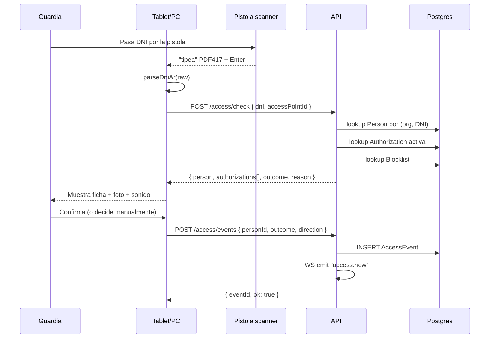

# 06 — Scanner DNI y flujo de acceso

## Hardware soportado

| Dispositivo | Modo | Notas |
| --- | --- | --- |
| Pistola USB HID (PDF417 capable) | HID keyboard emulation | Default. La pistola "tipea" el contenido del DNI seguido de Enter. |
| Pistola USB Serial | WebSerial API | Fallback para pistolas que no emulan teclado. Requiere Chrome/Edge. |
| Cámara del dispositivo | Decodificación en navegador | Para tablets. Usamos `@zxing/browser` para PDF417 y QR. |
| Lector RFID externo | HID o Serial | Para tarjetas de proximidad de residentes. |
| Cámara IP + ALPR | HTTP push al backend | Lectura de patentes en barreras. Detalle abajo. |

## PDF417 — DNI argentino

Formato del barcode del DNI (versiones actuales, "tarjeta"):

```
00000000 @ APELLIDO @ NOMBRES @ M/F @ DD/MM/YYYY @ NRO_DOC @ FECHA_EMISION @ ...
```

Separador `@`. Hay variantes (DNI viejo libreta, DNI nuevo tarjeta, distintos lotes). El parser soporta ambos.

```ts
// packages/scanner/src/parsers/dni-ar.ts
export type DniArData = {
  documentNumber: string;
  lastName: string;
  firstName: string;
  gender: 'M' | 'F' | 'X';
  birthDate: Date;
  cuil?: string;
};

const FIELD_SEP = '@';

export function parseDniAr(raw: string): DniArData | null {
  const parts = raw.split(FIELD_SEP).map((s) => s.trim());
  if (parts.length < 8) return null;

  // Heurística: formato nuevo
  // [0] número de trámite, [1] apellido, [2] nombres, [3] sexo, [4] DNI, [5] ejemplar, [6] fechaNac, [7] fechaEmision
  const [, lastName, firstName, gender, dni, , birth] = parts;
  if (!/^\d{6,9}$/.test(dni)) return null;

  return {
    documentNumber: dni,
    lastName: titleCase(lastName),
    firstName: titleCase(firstName),
    gender: gender as 'M' | 'F' | 'X',
    birthDate: parseDate(birth),
  };
}
```

Tests con corpus de DNIs reales (anonimizados) en `packages/scanner/__tests__/fixtures/`.

## Captura HID en el browser

Patrón **hidden global input always-focused**, con detección heurística de scanner vs. tecleo humano:

```ts
// apps/web/src/scanner/use-hid-scanner.ts
const FAST_KEY_INTERVAL_MS = 30;     // pistola tipea ~5-10ms entre teclas
const HUMAN_KEY_INTERVAL_MS = 100;
const SCAN_TIMEOUT_MS = 200;

export function useHidScanner(onScan: (raw: string) => void) {
  const buffer = useRef('');
  const lastTs = useRef(0);
  const flushTimer = useRef<number>();

  useEffect(() => {
    const onKey = (e: KeyboardEvent) => {
      // No interferir si hay un input enfocado por el usuario
      if (isUserInput(document.activeElement)) return;

      const now = performance.now();
      const delta = now - lastTs.current;
      lastTs.current = now;

      if (e.key === 'Enter') {
        if (buffer.current.length >= 20) {
          onScan(buffer.current);
          beep('success');
        }
        buffer.current = '';
        return;
      }

      if (delta > HUMAN_KEY_INTERVAL_MS && buffer.current.length > 0) {
        // gap demasiado largo, probablemente humano. Descartar.
        buffer.current = '';
      }

      if (e.key.length === 1) {
        buffer.current += e.key;
      }

      clearTimeout(flushTimer.current);
      flushTimer.current = window.setTimeout(() => {
        if (buffer.current.length >= 20) {
          onScan(buffer.current);
        }
        buffer.current = '';
      }, SCAN_TIMEOUT_MS);
    };

    window.addEventListener('keydown', onKey);
    return () => window.removeEventListener('keydown', onKey);
  }, [onScan]);
}
```

Notas:

- `isUserInput` chequea si el `activeElement` es input/textarea editable — para que el guardia pueda escribir en un campo sin que se intercepte.
- `beep('success' | 'denied' | 'warn')` reproduce un tono corto vía Web Audio API. Distinto sonido para cada outcome.
- Hay un toggle visual en el cockpit para activar/desactivar la captura global por si interfiere.

## Flujo de acceso (cockpit del guardia)



### Tiempo objetivo

- `POST /access/check` < 100 ms p95 (lookup + auths + blocklist).
- Render de ficha + foto < 150 ms.
- Total escaneo-a-feedback < 300 ms en p95.

Para llegar a esto:
- Índice `(organization_id, document_number_hash)` en `Person`.
- Cache LRU local en el cockpit de las últimas 200 personas escaneadas (Service Worker).
- Endpoint dedicado que precarga todo en una sola query con joins.

### Outcomes

| Outcome | Cuándo |
| --- | --- |
| `GRANTED` | Persona/vehículo con autorización vigente o residente activo. |
| `DENIED` | En blocklist o autorización expirada / fuera de horario. |
| `REVIEW` | Persona desconocida, sin autorización, pero sin razón explícita para denegar. El guardia decide. |

El cockpit muestra el outcome con colores y sonido distintivo. En `REVIEW`, el guardia puede:
- Llamar al residente (link a WhatsApp / botón "Notificar al residente" que dispara push + WA).
- Registrar como visitante one-off.

## QR de autorización

Cuando un residente genera una autorización, el sistema crea un QR con payload firmado:

```
bzapp://auth?v=1&t=<short_token>&exp=<unix_ts>
```

El `short_token` es un nanoid de 16 chars que se persiste en `Authorization.qr_code`. El backend valida:

1. Token existe y no está revocado.
2. `qr_expires_at` no pasó.
3. La hora actual cae dentro de `recurrence`.
4. Aún tiene usos disponibles (si `kind = SINGLE_USE`).

El QR se entrega por email/WhatsApp al visitante y como imagen descargable al residente.

## OCR de patentes (ALPR)

Dos modos:

### Modo cliente (tablet con cámara)
La cámara captura un frame al detectar movimiento (o por trigger del guardia). Se envía a `POST /access/ocr-plate` con la imagen. El route handler emite un evento Inngest `access/ocr.requested`; la función `ocr-plate` llama al proveedor ALPR (PlateRecognizer por default, OpenALPR self-hosted opcional). Si el guardia espera el resultado en vivo, el endpoint puede ejecutarlo synchronous con un timeout corto y fallback a polling.

### Modo cámara IP en barrera
La cámara IP hace push HTTP al endpoint dedicado del tenant con la imagen y metadatos. Mismo pipeline. El sistema busca el `Vehicle` por patente normalizada y si tiene autorización vigente, dispara comando a la barrera vía Integration.

```ts
// Normalización: BZ123CD, BZ 123 CD, bz123cd → BZ123CD
export const normalizePlate = (p: string) =>
  p.toUpperCase().replace(/[^A-Z0-9]/g, '');
```

## Modo offline (futuro, fase 3)

Para garitas con internet inestable: PWA con IndexedDB local que cachea Person + Vehicle + Authorization activas. Eventos se encolan localmente y se sincronizan cuando vuelve la red. Conflictos resueltos server-side (server gana en duplicados; cliente gana en orden temporal del `client_ts`).

## Anti-fraude y abuso

- **Rate limit** de escaneos por access point: máx. 1 escaneo cada 500 ms (debounce server-side).
- **Detección de pistola muteada**: si llegan 50 escaneos al mismo DNI en 5 minutos, alerta.
- **Foto del visitante** capturada por la tablet (cámara frontal) en cada acceso `REVIEW` o `GRANTED` de no-residente. Guardada en S3.
