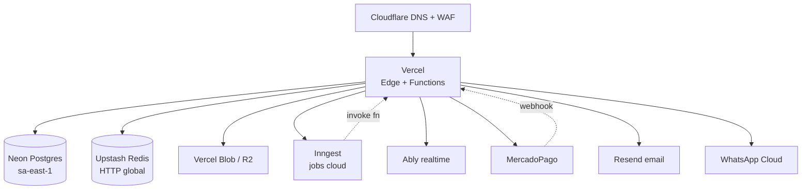

# 09 — Infraestructura (Vercel)

## Entornos

| Entorno | Vercel | DB Neon | Realtime / Jobs | URL |
| --- | --- | --- | --- | --- |
| `dev` | local (`vercel dev` o `next dev`) | branch `dev` | mock / dev keys | `localhost:3000` |
| `preview` | auto por PR | branch efímero por PR (Neon branching) | dev Inngest / Ably keys | `pr-<n>-bzapp.vercel.app` |
| `staging` | branch `staging` | DB `staging` | staging keys (MP sandbox) | `staging.bzapp.io` |
| `prod` | branch `main` | DB `prod` con PITR | prod keys (MP live) | `bzapp.io`, `*.bzapp.io` |

## Stack final



## Vercel

### Configuración del proyecto

- **Framework**: Next.js (detectado automáticamente).
- **Node runtime** en route handlers que tocan DB. Edge runtime solo en middleware liviano.
- **Function regions**: `gru1` (São Paulo) único. Configurado en `vercel.json`:

```json
{
  "regions": ["gru1"],
  "functions": {
    "app/api/v1/access/check/route.ts": {
      "memory": 1024,
      "maxDuration": 10
    },
    "app/api/webhooks/mercadopago/route.ts": {
      "memory": 512,
      "maxDuration": 30
    },
    "app/api/v1/reports/exports/route.ts": {
      "memory": 1024,
      "maxDuration": 60
    },
    "app/api/inngest/route.ts": {
      "memory": 1024,
      "maxDuration": 300
    }
  },
  "crons": [
    { "path": "/api/cron/billing-dunning", "schedule": "0 9 * * *" },
    { "path": "/api/cron/access-event-archive", "schedule": "0 3 * * *" },
    { "path": "/api/cron/invitations-expire", "schedule": "0 * * * *" }
  ]
}
```

- **Fluid Compute** activado para minimizar cold starts (mantiene instancias warm más tiempo, comparte conexiones DB entre invocaciones).
- **Image Optimization** activada para fotos de personas y logos.
- **Custom domains**: `bzapp.io` apex, `*.bzapp.io` wildcard para subdomain de tenants. Cloudflare por encima para WAF y caching de assets.

### Variables de entorno

Categorizadas por scope (production / preview / development):

```bash
# DB
DATABASE_URL=postgres://...neon...    # connection string Neon pooled
DATABASE_URL_UNPOOLED=postgres://...   # direct connection para migraciones
DATABASE_SHADOW_URL=...                # solo dev/CI

# Auth
JWT_SECRET=...
JWT_REFRESH_SECRET=...
NEXTAUTH_URL=https://bzapp.io          # solo si se usa NextAuth (no es el caso)

# Upstash
UPSTASH_REDIS_REST_URL=...
UPSTASH_REDIS_REST_TOKEN=...

# Storage
BLOB_READ_WRITE_TOKEN=...              # si Vercel Blob
# O bien
R2_ACCESS_KEY_ID=...
R2_SECRET_ACCESS_KEY=...
R2_ACCOUNT_ID=...
R2_BUCKET=bzapp-uploads

# Inngest
INNGEST_EVENT_KEY=...
INNGEST_SIGNING_KEY=...

# Ably (fase 2)
ABLY_API_KEY=...

# MercadoPago
MP_ACCESS_TOKEN=...
MP_WEBHOOK_SECRET=...

# Resend
RESEND_API_KEY=...
EMAIL_FROM=BZAPP <hola@bzapp.io>

# WhatsApp Cloud
WA_PHONE_NUMBER_ID=...
WA_ACCESS_TOKEN=...
WA_VERIFY_TOKEN=...

# ALPR
PLATE_RECOGNIZER_TOKEN=...

# Observability
SENTRY_DSN=...
SENTRY_AUTH_TOKEN=...
AXIOM_TOKEN=...
AXIOM_DATASET=bzapp-prod

# Encryption (campo a campo)
ENCRYPTION_KEY=...                     # 32 bytes hex
ENCRYPTION_HASH_KEY=...                # HMAC key para document_number_hash
```

Sincronización: **Vercel CLI** (`vercel env pull .env.local`) o `dotenv-vault` para el equipo.

## Neon Postgres

### Setup

- Proyecto: `bzapp`.
- Región: `aws-sa-east-1`.
- Branches:
  - `main` → prod
  - `staging` → staging
  - `dev` → desarrollo local
  - Branches efímeros por PR vía integración Vercel ↔ Neon (creados/destruidos auto).
- **Compute**: empezar con autoscaling 0.25 → 1 CU, escalar según uso.
- **PITR**: 7 días en producción, 24h en staging.
- **Connection pooling**: usar el endpoint pooled (`-pooler` en host) para route handlers. Endpoint direct para migraciones Prisma.

### Prisma + Neon

```ts
// packages/db/src/index.ts
import { PrismaClient } from '@prisma/client';
import { PrismaNeon } from '@prisma/adapter-neon';
import { Pool } from '@neondatabase/serverless';

const pool = new Pool({ connectionString: process.env.DATABASE_URL });
const adapter = new PrismaNeon(pool);
export const prisma = new PrismaClient({ adapter });
```

El adapter Neon usa HTTP/WebSocket en lugar de TCP, ideal para serverless (sin idle connections que se mueren entre invocaciones).

### Particionamiento de `access_events`

Sigue siendo crítico. Particionada por `occurred_at` mensual. Neon soporta esto nativamente.

```sql
-- Migración inicial
CREATE TABLE access_events (
  ...
) PARTITION BY RANGE (occurred_at);

-- Crear particiones manualmente o vía pg_partman si Neon lo habilita.
-- Si no, una función Inngest cron crea la partición del mes siguiente.
```

Función Inngest `ensure-monthly-partitions` corre el día 25 de cada mes y crea la partición del mes siguiente.

### Row Level Security

Activada en todas las tablas tenant-scoped. Cada conexión hace `SET LOCAL app.current_tenant = '...'` antes de cualquier query, dentro de la transacción de Prisma.

Detalle de policies en [02 — Multi-tenancy](02-multi-tenant.md).

## Upstash Redis

### Usos

| Caso | Estructura | TTL |
| --- | --- | --- |
| Rate limit | sorted set por `user_id` o `ip` | 1 min |
| Cache de Person por DNI (cockpit) | string `person:{org}:{dni_hash}` JSON | 5 min |
| Cache de Authorization activa | string `auth:{org}:{person_id}` JSON | 1 min |
| Pub/sub para SSE realtime | channel `org:{id}:access` | — |
| Idempotency keys (POST cobros) | string con resultado de la primera ejecución | 24 h |
| Session blocklist (revocación de access tokens antes de expirar) | set | hasta exp del token |
| Distributed lock (procesamiento de webhook MP) | string con NX | 30 s |

### Cliente

```ts
// lib/server/infra/redis.ts
import { Redis } from '@upstash/redis';
export const redis = Redis.fromEnv();
```

Soporta HTTP nativo, funciona perfecto en Vercel.

## Inngest

### Setup

- Proyecto `bzapp` en Inngest cloud.
- Plan free hasta 50k steps/mes, después Pay-as-you-go.
- Endpoint expuesto en `/api/inngest`:

```ts
// app/api/inngest/route.ts
import { serve } from 'inngest/next';
import { inngest } from '@/lib/inngest/client';
import * as functions from '@/lib/inngest/functions';

export const { GET, POST, PUT } = serve({
  client: inngest,
  functions: Object.values(functions),
});
```

### Funciones definidas

| Función | Trigger | Descripción |
| --- | --- | --- |
| `process-mp-webhook` | event `mp/webhook.received` | Procesa preapproval/payment events con dedupe por `mp_event_id` |
| `send-email` | event `email/send` | Resend con reintentos |
| `send-whatsapp` | event `whatsapp/send` | WA Cloud con backoff |
| `generate-invoice-pdf` | event `invoice/created` | Puppeteer + Blob upload |
| `ocr-plate` | event `access/ocr.requested` | Llama a Plate Recognizer |
| `export-report` | event `reports/export.requested` | Stream a Blob, devuelve URL |
| `dispatch-outbound-webhook` | event `webhook/dispatch` | POST a endpoints del cliente, reintentos |
| `dunning-step` | cron `0 9 * * *` | Revisa subs PAST_DUE, escala según día |
| `archive-old-access-events` | cron `0 3 * * *` | Mueve eventos > 24m a parquet en R2 |
| `expire-invitations` | cron `0 * * * *` | Marca invitaciones expiradas |
| `ensure-monthly-partitions` | cron `0 0 25 * *` | Crea partición del próximo mes |

### Idempotencia y concurrencia

Inngest soporta nativamente concurrency keys (1 ejecución por `preapprovalId` evita race conditions en webhooks) y debounce. Cada `step.run` es retryable con cache, así que si el step de "emit-invoice" falla pero el de "apply-transition" pasó, no se re-ejecuta el primero.

## Vercel Cron

Para tareas que no encajan en eventos:

```jsonc
// vercel.json
"crons": [
  { "path": "/api/cron/billing-dunning", "schedule": "0 9 * * *" },
  { "path": "/api/cron/access-event-archive", "schedule": "0 3 * * *" }
]
```

Los crons disparan endpoints que solo emiten un evento Inngest — el cron en sí no hace trabajo pesado, así evitamos timeouts de Vercel Cron.

## Storage

### Vercel Blob (recomendado al inicio)

- Integrado, sin config extra.
- Resumable uploads, presigned URLs.
- Costo: USD 0.15/GB almacenado + USD 0.30/GB egress.

### Cloudflare R2 (a partir de fase 2 si el volumen crece)

- Egress gratis. Más barato si servimos muchas fotos.
- Migración: setup paralelo, cambiar `STORAGE_PROVIDER=r2` env, backfill background.

Estructura de keys:

```
{organizationId}/persons/{personId}/photo.jpg
{organizationId}/access/{eventId}/snapshot.jpg
{organizationId}/invoices/{invoiceId}.pdf
{organizationId}/exports/{exportId}.csv
```

## Realtime

### SSE (fase 1)

- Route handler con `runtime = 'nodejs'` y `dynamic = 'force-dynamic'`.
- Suscribe a Upstash Redis pub/sub.
- Heartbeat cada 25 s.
- Reconexión exponencial en el cliente.
- Vercel Function timeout: configurar 300s y aceptar reconexión periódica.

### Ably (fase 2)

- Token request endpoint en `/api/v1/realtime/token` firma capabilities por org y user.
- Cliente se conecta con SDK Ably.
- Canales: `org:{id}:access`, `org:{id}:alerts`, `presence:org:{id}:guards`.

## Email — Resend

- Dominio `bzapp.io` verificado con DKIM/SPF/DMARC.
- React Email para plantillas (tipadas, preview en `npm run email`).
- Tracking de opens/clicks opcional, default off por privacidad.
- Webhook de Resend → Inngest → actualiza `Notification.status`.

## Observabilidad

### Vercel nativo

- **Vercel Observability**: latencia por route, error rate, function duration.
- **Web Analytics**: PageViews, Core Web Vitals.
- **Speed Insights**: RUM.

### Sentry

- DSN client + DSN server (separados para distinguir errores).
- Sourcemaps automáticos vía integración Vercel.
- Performance monitoring sample 10 % en prod.
- Tags por request: `tenant_id`, `user_id`, `endpoint`.

### Axiom (logs)

- Vercel log drain → Axiom dataset `bzapp-prod`.
- Estructurados JSON con `pino`.
- Correlación por `request_id` (header `x-request-id` autogenerado).

### Inngest

- Dashboard propio para inspección de runs, replays, reintentos manuales.

## Backups y recuperación

- **Neon**: PITR 7 días + branch snapshot automático antes de cada migración prod.
- **Blob / R2**: versioning ON, lifecycle de versiones viejas a clase fría tras 30 días.
- **Restore drill**: trimestral en staging.
- **Backup lógico**: semanal con `pg_dump` desde un job Inngest a R2, encriptado con KMS-equivalente.

## Seguridad

- TLS 1.3 (Vercel).
- HSTS preload activado.
- Secrets en Vercel Env, nunca en repo.
- `Content-Security-Policy` estricta (configurada en `middleware.ts`).
- CORS por origen permitido (subdomain de cada tenant).
- Rate limit con Upstash en endpoints sensibles.
- Argon2id para passwords.
- Campo-a-campo encryption de `document_number`, `phone`, `email` de visitantes (`@noble/ciphers` AES-GCM).
- Pentest antes de GA.

## CI/CD

GitHub Actions + Vercel Git Integration:

1. **PR abierto**: Vercel hace deploy preview automático + Neon crea branch DB. Tests E2E sobre la URL preview.
2. **Merge a `main`**: Vercel deploy a producción. Migración Prisma ejecutada antes vía `vercel deploy --prebuilt` hook o GitHub Action paso previo.
3. **Tag `v*`**: changelog generado, anuncio.

Rollback: Vercel "Promote previous deployment" + Neon branch revert (snapshot pre-migration).

## Costo estimado fase 1-2

| Servicio | Plan | Costo/mes USD |
| --- | --- | --- |
| Vercel Pro | Team plan + uso | 20 + uso (10-30) |
| Neon | Launch | 19 |
| Upstash Redis | PAYG | 0-10 |
| Inngest | Starter | 0-20 |
| Vercel Blob o R2 | uso | 5-15 |
| Resend | Pro | 20 |
| Ably (fase 2) | Starter | 0-29 |
| Sentry | Team | 26 |
| Axiom | uso | 0-25 |
| **Total** | | **~120-200 USD** |

A 500 organizaciones activas pagando USD 30/mes promedio = USD 15k MRR, los costos de infra son ~3-4 % del revenue. Sostenible.

## Performance budgets

| Métrica | Budget |
| --- | --- |
| `/v1/access/check` p95 | < 250 ms |
| API genérica p95 | < 400 ms |
| Vercel Function cold start p95 | < 800 ms |
| Web FCP | < 1.2 s |
| Web TTI | < 2.0 s |
| Web bundle initial | < 200 KB gzipped |
| Neon active connections | < 70 % saturación |
| Inngest queue lag p95 | < 30 s |
